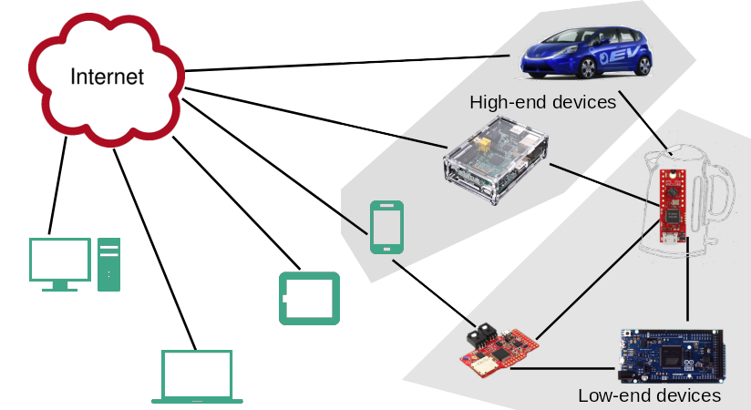
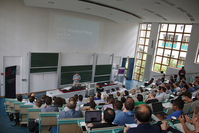
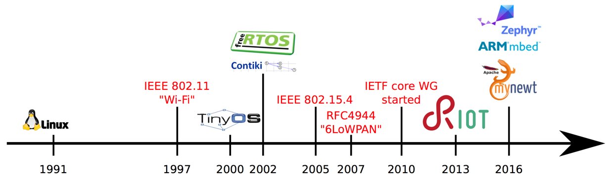
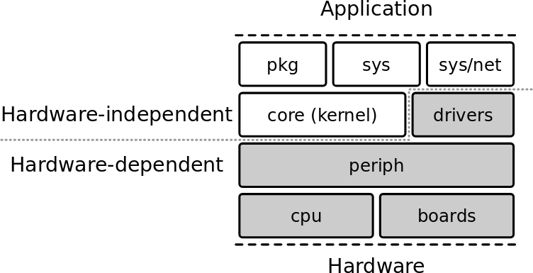
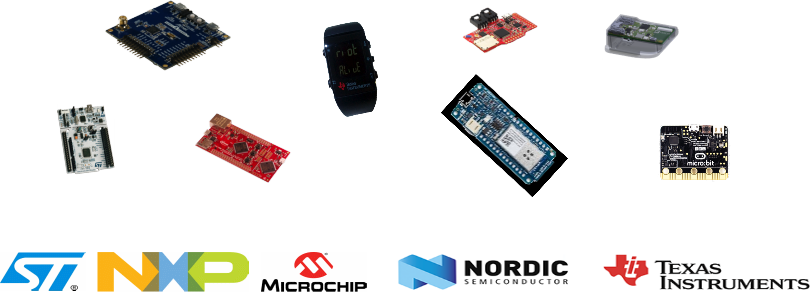
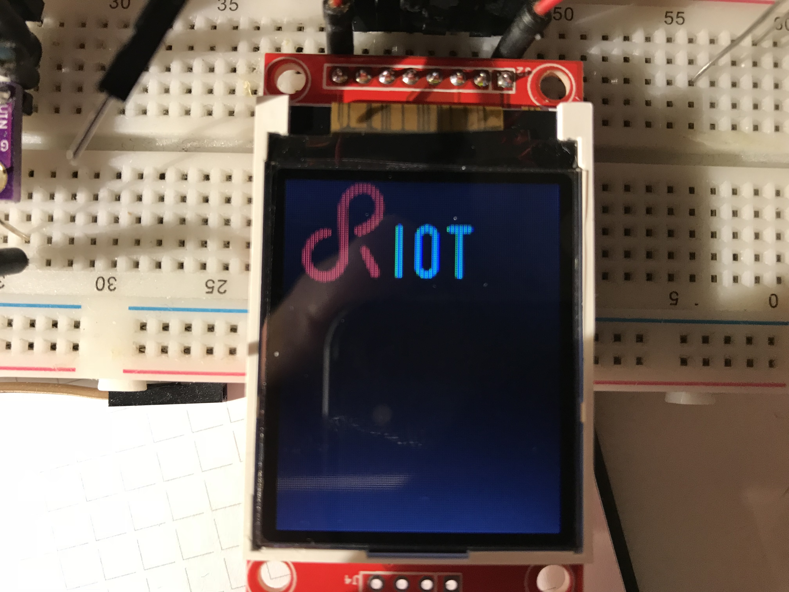
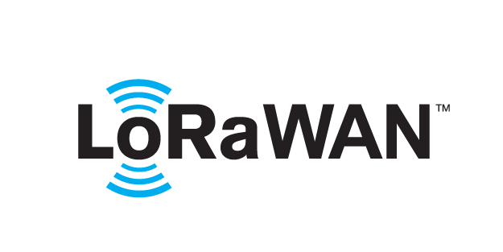
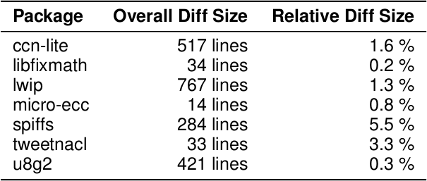

class: center, middle

# Introduction

---

## What is RIOT

  

RIOT is

- a real-time multithreaded operating system

 - built with in-house networking capababilities
 - designed for microcontroller based devices

- open-source: https://github.com/RIOT-OS/RIOT

 - free software platform
 - world-wide community of developers

  

.center[
    
]

---

## RIOT in the IoT world

.center[
  
  
&#x21d2; RIOT is designed for low-end devices
 (kB RAM, MHz, mW)
]

---

## History of the project

- 2013: Inria, FU Berlin and HAW found RIOT 
 - stemed from a French-German research project
 - kernel evolved from FireKernel

- The community today:

  - More than 180 contributors to the master branch, so far
  - Academics: Inria, FU Berlin, HAW Hamburg, Berkeley, UCLA, MIT, TZI
  - Industrial: Cisco, Samsung, ImgTec, Fujitsu, Thalès
  - SME: Zolertia, OTAKeys, Mesotic, Eistec, We-sens

- Annual RIOT Summit: https://summit.riot-os.org

.right[

]

---

## The RIOT philosophy & community

- RIOT is free-software, licensed under LGPLv2.1

- The community takes inspiration from Linux

.right[
    
]

- Use standards whenever possible  
  (C-ANSI, standard tools, standard protocols, standard procedures)

- Follow POSIX standards

- Avoid code duplication, easy to program, increase portability, modularity

- Vendor & Technology independence

- Decisions and orientations are taken by a grass-root community

.center[
    
]

---

## Competitors

.center[
    
]

Reference: O. Hahm et al. "Operating Systems for Low-End Devices 
in the Internet of Things: A survey," IEEE Internet of ThingsJournal, 2016.

 
 

- Typically, RIOT compared to other OSes:
 - requires less memory & adapts to a wider range of architectures;
 - provides more complete OS functionalities (for instance, in comparison, FreeRTOS is just a scheduler, Arduino is a hardware abstraction layer);
 - fosters an open-source philosophy more akin to Linux.

---

## Who is using RIOT?

**Example IoT solutions deployments using RIOT**

- Telefonica: LoRa devices in a mine 
http://summit.riot-os.org/2017/blog/2017/10/06/slides/

- Almagro: Automatic cereal dispenser 
https://www.indiegogo.com/projects/the-venture-algramo-chile#/

- Fujitsu: IoT modules orchestration 
http://riot-os.org/files/RIOT-Summit-2017-slides/4-3-Virtualization-Session-Fujitsu.pdf

- Cisco, Huawei: experimental deployment using ICN-IoT

**Example IoT products & services using RIOT**

- Environment monitoring: Hamilton IoT (USA), Unwired Devices (Russia)

- On-Board diagnostics for connected cars: OTAKeys (Continental)

- Smart House, Smart City: Eistec (Sweeden), Mesotic (France)

- GPS tracking device with GSM modem: Sleeping Beauty (Germany)

---

class: center, middle

# Technical overview

 
Long story short: paper in IEEE Internet of Things Journal 
Preprint available: http://riot-os.org/files/2018-IEEE-IoT-Journal-RIOT-Paper.pdf

---

## OS characteristics

- Micro-kernel based architecture: modular approach

.center[
    
]

- Multi-Threading and IPC:
  - Separate thread contexts with separate thread memory stack
  - Minimal thread control block (TCB)
  - Thread synchronization using mutexes, semaphores and messaging

- Real-Time scheduler
  - &#x21d2; fixed priorities preemption with O(1) operations
  - &#x21d2; tickless scheduler

- Small footprint &#x21d2; 2.8kB RAM, 3.2kB ROM on 32-bit Cortex-M

---

## Multi-Threading

2 threads by default:

- the `main` thread: running the `main` function

- the `idle` thread:

  - lowest priority  &#x21d2; fallback thread when all other threads are blocked or terminated
  - switches the system to low-power mode

The ISR context handles external events and notifies threads using IPC messages

.center[
    
]

---

## Hardware support overview

- Support for 8/16/32 bit, ARM, AVR, MIPS

- `native` board: run RIOT as process on your computer

- Supported vendors: Microchip, NXP, STMicroelectronics, Nordic, TI, etc

- Large list of sensors and actuators supported (e.g drivers)

- Concept of "board" that simplify ports &#x21d2; +100 boards supported

  

.center[
    
]

---

## Hardware abstraction layer

- Divided in 3 blocks: boards, cpus, drivers

- CPUs are organized as follows: 
**architecture** (ARM) > **family** (stm32) > **type** (stm32l4) > **model** (stm32l476rg)

- Generic API for cpu peripherals (gpio, uart, spi, pwm, etc)

    &#x21d2; same API for all architectures

- Only based on vendor header files (CMSIS) &#x21d2; implementation from scratch

    &#x21d2; less code duplication, more efficient, more work

- One application &#x21d2; one board &#x21d2; one cpu model

.center[
    
]

---

## High-level drivers

- Sensors and actuators

    &#x21d2; temperature, pressure, humidity, IMU, light sensors, radios, sd card, etc

- Memory Techonology Device (MTD) abstraction and filesystems

    &#x21d2; FatFS, LittleFS, SPIFFS

- Display drivers

    &#x21d2; u8g2, ucglib, HD44780

.center[
    
]

---

## Useful system libraries

- **xtimer**

  - high-level timer subsystem that provides full abstraction from the hardware timer

  - Can set callbacks, put a thread to sleep, etc

- **shell**

  - provides interactive command line interface

  - useful for interactive debugging or examples

- **Others:** crypto, fmt, math, etc

---

## Network stacks and protocols

3 types of network stacks:

- IP oriented stacks &#x21d2; designed for Ethernet, WiFi, 802.15.4 networks
  - **GNRC**: the in-house 802.15.4/6LowPAN/IPv6 stack of RIOT

  - **Thread**: another 802.15.4 IPv6 stack supported by NestLabs (Google)
.center[
    
]
  - **lwIP**: full-featured network stack designed for low memory consumption

  - **emb6**: A fork of Contiki network stack that can be used without proto-threads

- In-house Controller Area Network (**CAN**)

- **LoRaWAN** stack: port of Semtech loramac-node reference implementation

.center[
    
]

---

## External packages

- RIOT can be extended with external packages

- Integrated (and eventually patched) on-the-fly while building an application

- Easy to add: just requires 2 `Makefiles`

- Example of packages: lwIP, Openthread, u8g2, loramac, etc

  

.center[
    
]

---

## Ecosystem & community processes

- Tooling and build system

      - hand crafted makefiles for building a RIOT application

  - On-Chip debugging with **OpenOCD** and **GDB**

- Distributed and fast CI, Murdock: https://ci.riot-os.org

    &#x21d2; Build all test/example applications for all targets  
    &#x21d2; Static tests (Cppcheck, Coccinelle, etc)  
    &#x21d2; Run on hardware (WIP)

- Online documentation generated with Doxygen

    &#x21d2; https://doc.riot-os.org

- In-depth code reviews

- One release every 3 month: **&lt;year&gt;.&lt;month&gt;** (ex: 2018.01, 2018.04, etc)

---

## Summary

- Generalities on RIOT: history, community, users

- A technical overview:

  - OS charactéristics

  - hardware support

  - libraries

  - network stack

  - import external libraries via packages

- The RIOT ecosystem:

  - standard tools

  - CI

  - documentation

  - releases