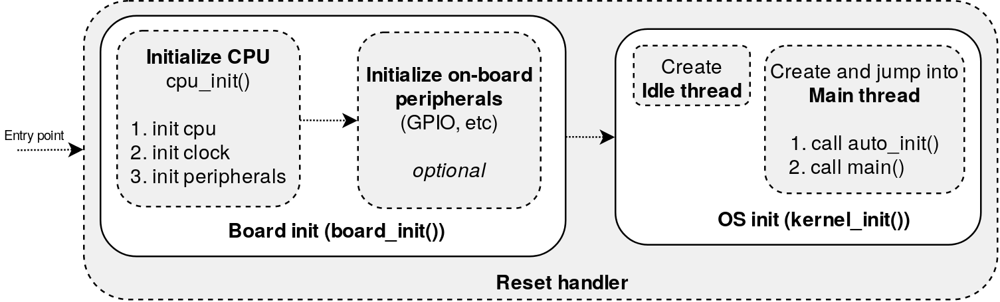
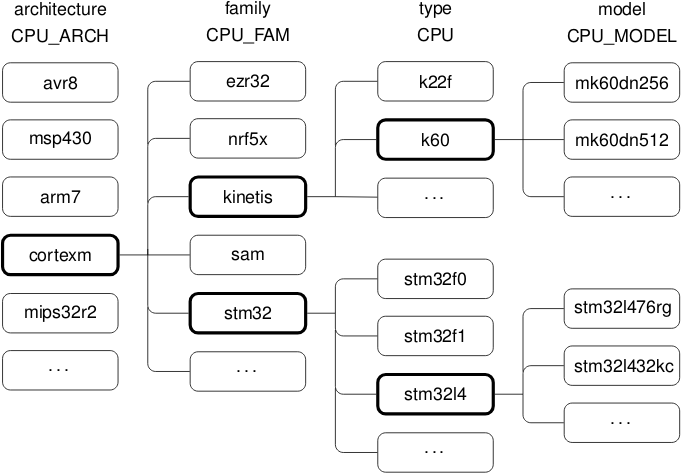

class: center, middle

# RIOT basics

---

## System overview

.center[
    
]

---

## Source code organization

- **boards:** board specific definitions, cpu model, clock, peripherals
   config, documentation, serial and flasher config (dist)

- **core:** kernel initialization, thread, ipc

- **cpu:**  support for microcontroller (cmsis, definitions, peripheral
  drivers), entry point (_reset\_handler\_default_)

- **dist:** management and utility tools (script, ci, static checkers, etc)

- **doc:** doxygen documentation

- **drivers:** high-level device drivers (sensors, actuators, radios), HAL API

- **examples:** sample applications

- **makefiles:** build and management system makefiles

- **pkg:** external packages

- **sys:** system libraries, network, shell, xtimer, etc

- **tests:** unittests, test applications (can be used as examples)

---

## The build system

- A set of hand crafted `Makefiles` &#x21d2; more control

- Run **make** from the application directory:
```
$ cd <application_dir> && make all
$ make -C <application_dir> all
```

- _RIOTBASE_ variable points to the RIOT source code

- _$(RIOTBASE)/Makefile.include_ defines all targets

- Modules:
  - `module name = directory basename`

  - simply include _$(RIOTBASE)Makefile.base_ in the module _Makefile_

  - all `.c` are added to the module

- in `drivers`, `sys`, `pkg`
  - _Makefile.include_: add include specific directories to the build system

  - _Makefile.dep_: manage dependencies between modules

---

## The build system

- High-level useful targets (besides _all_, _flash_, _term_, _debug_):

  - **info-build:** give useful information about the build (board supported, cpu, modules included, etc)

  - **flash-only:** don't rebuild before flashing (_flash_ depends on _all_)

  - **list-ttys:** return the list of serial ports available with information on the board connected (useful when working with multiple boards)

  - use `<table>` (autocompletion) to get the full list

- For every module `xx` imported, a **MODULE_XX** macro is created:
```c
#ifdef MODULE_XX
/* conditional code when module XX is loaded */
#endif
```
&#x21d2; very useful to optimize code size

---

## The RIOT kernel

- Overview of the boot sequence:

.center[
    
]

- `board_init()` is implemented in `boards/<board name>/board.c` file

- `cpu_unit()` is implemented in `cpu/<cpu model>/cpu.c` file

- `kernel_init()` is implemented in `core/kernel_init.c` file

- Example for ARM Cortex-M:

 - the entry point is `reset_handler_default`

 - implemented in `cpu/cortexm_common/vectors_cortexm.c` file

---

## The scheduler and the threads

- Tick-less scheduling policy (`O(1)`)

- Highest priority thread runs until finished or blocked:
  - 16 priority levels
  - the lower level the higher priority
  - Idle thread has priority 15
  - Main thread has priority 7

- ISR can preempt any thread at any time

- If all threads are blocked:
  - Switch to special IDLE thread
  - Goes into low-power mode

- A Thread is just a function with signature:
```c
void *thread_handler(void *arg);
```

- Threads manage their own memory stack

---

## Dealing with Threads

- Threads are created using the `thread_create()` function from `thread.h`:
```c
kernel_pid_t pid;
pid = thread_create(stack,  /* stack array pointer */
                        sizeof(stack), /* stack size */
                        THREAD_PRIORITY_MAIN - 1, /* thread priority*/
                        flag, /* thread configuration flag, usually*/
                        thread_handler, /* thread handler function */
                        NULL, /* argument of thread_handler function*/
                        "thread name");
```
- By default, the thread starts immediately

- `stack` is a global static byte array:
```c
static char stack[THREAD_STACKSIZE_MAIN];
```

- Priority is higher than `main` thread

- Useful: `thread_getpid()` return the current thread pid

--

.center[&#x21d2; more usage examples in `tests/thread_*` test applications]

---

## Thread: practice

- **Exercise:** `~/riot-course-exercises/riot-basics/first-thread`

- **Board:** native

- In your application add a thread that prints "Hello from thread"<br><br>
_Reminder:_
```c
#include "thread.h"
static char stack[THREAD_STACKSIZE_MAIN];
void *thread_handler(void *arg)
{
        /* thread code */
        return NULL;
}
kernel_pid_t pid = thread_create(stack,
                                     sizeof(stack),
                                     THREAD_PRIORITY_MAIN - 1,
                                     0,
                                     thread_handler,
                                     NULL,
                                     "thread name");
```

- Verify the message is correctly displayed (use native and the board)

---

## Thread: practice

- Add `shell` and `ps` modules to your application

- Rebuild, restart and run `ps` command

- Display the list of threads. Comments?

--

.right[
    &#x21d2; The thread has already returned!
]

--

- Now add an infinite loop before the return:

```c
while (1) {}
```
- Reboot and run `ps` again. Comments ?

--

.right[
    &#x21d2; Your thread has a higher priority, so the shell never starts!
]

--

- Set a lowest priority to the `thread` (e.g. higher value)

- Test your final application on the ST `b-l072z-lrwan1` board

---

## Managing thread concurrency

- Threads have their own stack

- But threads can also access the global shared memory of the application

    &#x21d2; protection and synchronization mechanisms are required

- RIOT provides:

  - Mutexes in `mutex.h`:
```c
mutex_t lock;
mutex_lock(&lock);
mutex_unlock(&lock);
```

  - Semaphores in `sema.h` (also POSIX semaphores in `semaphores.h`)

--

<br>

.center[&#x21d2; More usage examples in `tests/mutex_*` test applications]

---

## IPC

- IPC messages can be exchanged between threads or between ISR and threads

- IPC are **synchronous** by default or **asynchronous**

- The messaging API is defined in `msg.h` (in `core`):
  - The message type is `msg_t`
  - A message have a `type` and a `content`

```c
msg_t msg;
msg.type = MSG_TYPE;
msg.content.value = 42; /* content can be a value */
msg.content.ptr = array; /* or content can be a pointer */
```
  - Sending a message:

```c
msg_send(&msg, pid); /* block except when called from an interrupt */
msg_try_send(&msg, pid); /* non blocking send */
msg_send_receive(&msg, &msg_reply, pid); /* block until a reply is received */
msg_reply(&msg, &msg_reply); /* reply to a message */
```

---

## IPC

- Receiving messages:

```c
msg_receive(&msg); /* block until a message is received */
msg_try_receive(&msg); /* try to receive a message without blocking */
```

- Typical use case: a thread waiting for messages from another thread or ISR

```c
void *thread_handler(void *arg)
{
    /* endless loop */
    while (1) {
        msg_t msg;
        msg_receive(&msg);
        printf("Message received: %s\n", (char *)msg.content.ptr);
    }
    return NULL;
}
```

- When using synchronous messaging (typically the case with ISR), always
  initialize a thread message queue in the thread handler:

```c
msg_t msg_queue[8];
msg_init_queue(msg_queue, 8);
```

---

## IPC: practice

- **Exercise:** `~/riot-course-exercises/riot-basics/thread-ipc`

- **Board:** native and `b-l072z-lrwan1` board

- **Objective:**

  - Write a shell command that sends a string to a thread

  - The receiver thread prints each received message

- **Going further:** `~/riot-course-exercises/riot-basics/thread-safe-ipc`:

  - Modify a global static buffer and send a message to the receiver thread

  - Ensure thread safety using a mutex. You will have to define a struct:

  ```c
typedef struct {
        char data[BUFFER_SIZE];
        mutex_t lock;
} data_buffer_t;
  ```

  - Ensure thread safety using a blocking message exchange (use `msg_send_receive`, the previous struct is not needed)

---

## Timers

- High level timer provided by module `xtimer`

- `xtimer` multiplex hardware timers

- microseconds accuracy

- Simple API:

  - get current system time in microseconds

```c
xtimer_ticks32_t now = xtimer_now();
```

  - add a `sec` seconds delay

```c
xtimer_sleep(sec);
```

  - add a `microsec` mircroseconds delay

```c
xtimer_usleep(microsec);
```

---

## Timers (continued)

- Use xtimer for periodic wakeups:

```c
void xtimer_periodic_wakeup(xtimer_ticks32_t *last_wakeup, uint32_t period);
```

  - Use an `xtimer_t` variable to send a message at a given time:

```c
void xtimer_set_msg(xtimer_t *timer, uint32_t offset, msg_t *msg,
                    kernel_pid_t target_pid);
```

  - Use an `xtimer_t` variable to trigger a callback function at a given time:

```c
xtimer_set(xtimer_t *timer, uint32_t offset);
```

- helper defines are also provided by `timex.h` to convert seconds to us, ms to us, etc:
```c
US_PER_SEC  /* number of microseconds per seconds */
US_PER_MS   /* number of milliseconds per seconds */
```

---

## Timers: practice

- **Exercise:** `~/riot-course-exercises/riot-basics/timers`

- **Board:** ST `b-l072z-lrwan1` board

- _Reminder_

  - Use `LEDx_TOGGLE` macros from `board.h` to toggle the LEDs.
  - The ST board has 3 LEDs (LED1, LED2 and LED3)

- **Objective:** Write an application with 3 extra threads:

  - add the module `xtimer` in the application `Makefile`

  - _thread\_1_ toggles the LED1 every half seconds

  - _thread\_2_ toggles the LED2 every seconds

  - _thread\_3_ prints the system time every 2 seconds

---

## Power management

**Principle:** <br>
> _when all threads are blocked/terminated, the scheduler switches to the_
> _idle thread._<br>
> _The idle thread then goes to lowest possible power mode._

<table>
<tr>
  <td>
    <ul>
      <li>the desired low-power mode must be unblocked<br><br></li>
      <li>the lowest possible power mode is selected ("Cascade")<br><br></li>
      <li>API is defined in `pm_layered.h` from system `pm_layered` module</li>
    </ul>
  </td>
  <td>
.center[
    
]
  </td>
</tr>
</table>

**Important:**
- The board MCU must import the `pm_layered` module
- Still WIP, the design is subject to change in the future

---

## The hardware abstraction layer

- Hardware abstraction layer relies on 3 blocks: **cpus**, **boards** and **drivers**

.center[
    
]

- Reflects IoT devices targetted by RIOT<br><br>
    &#x21d2; a microcontroller with devices connected together on a board

- One application is built for one board with one device and with potentially multiple devices (sensors, actuators, radios)

---

## CPU abstraction

CPUs classification follows a hierarchical approach:

- **architecture** e.g ARM, AVR

- **family** e.g stm32, sam

- **type** e.g stm32l0, stm32l1, sam0, sam3

- **model** e.g stm32l072cz, samd21g18a

<table>
<tr>
  <td>
    <ul>
      <li>This organisation is not mandatory<br><br></li>
      <li>`native` port is provided in a single module<br><br></li>
    </ul>
  </td>
  <td>
.center[
    
]
  </td>
</tr>
</table>

---

## Board abstraction

- Each directory in `boards` creates a board module<br>
  &#x21d2; `BOARD=<board module name>`

- MCU family and model used are defined in `Makefile.include`

- The list of features provided (e.g MCU peripheral) is defined in `Makefile.features`

- The configurations of clocks and of each MCU peripherals in are defined in `periph_conf.h`

- `board.h` provides specific on-board defines for:

  - Configurations for the `xtimer` module

  - on-board LEDs and buttons pins

  - on-board high-level device drivers (sensor, actuators, radios)

---

## MCU peripherals APIs

- Uniform APIs built on top of heterogeneuous hardwares

- The same code can run potentially on every hardware

- APIs are defined in `drivers/include/periph` and implemented in each cpus `periph` subdirectory

- Explicitly include a peripheral module in your Makefile with the **FEATURES_REQUIRED** variable

- The peripheral drivers are implemented from scratch. This garantees:

  - Memory efficiency

  - Less code duplication

  - Vendor independent implementations

- See `tests/periph_*` application for usage examples

- See APIs documentation: http://doc.riot-os.org/group__drivers__periph.html

---

## GPIO peripheral API

- Module name is **periph_gpio**, include from **periph/gpio.h**

- use GPIO_PIN(PORT, PIN) macro to get a gpio pin from port/pin

- all GPIO usual mode could be used, but this depends on the hardware behind

- Use a `gpio_init_int()` to use a gpio as external interrupt:

```c
static void gpio_cb(void *arg)
{
    (void) arg;
    /* manage interrupt */
}

int main()
{
    gpio_init_int(GPIO_PIN(PA, 0), GPIO_IN, GPIO_RISING, gpio_cb, NULL);
}
```

---

## GPIO: practice

- **Exercise:** `~/riot-course-exercises/riot-basics/gpio`

- **Board:** ST `b-l072z-lrwan1`

- **Note:** Use predefined `BTN_B1_PIN` and `LED1_PIN` macros and include `board.h`

- **Objective:**

  - Write an application with one thread that waits for incoming messages

  - For each message, the thread toggles the on-board LED1

  - The on-board B1 user button and LED1 are initialized as follows in `main()`:
      - LED1 is initialized in GPIO_OUT mode
      - B1 is initialized in GPIO_IN mode with an interrupt callback function,
        `gpio_cb`, an interrupt is raised each time the button is pressed

  - For each interrupt, a message is sent from the ISR to the led management thread &#x21d2; it toggles the LED1 status

_Note: we won't take care of the debounce issue_

---

## UART peripheral API

- Allows to send and receive messages asynchronously from an UART

- Module name is **periph_uart**, include from **periph/uart.h**

- UART peripheral triggers an interrupt on each character received

```c
static void uart_cb(void *arg, uint8_t data)
{
    (void) arg;
    /* manage interrupt */
}

int main()
{
    uart_init(UART_DEV(0), BAUDRATE, uart_cb, NULL);
}
```

---

## UART: practice

- **Exercise:** `~/riot-course-exercises/riot-basics/uart`

- **Board:** ST `b-l072z-lrwan1`

- **Note:** Use first UART (USB), e.g `UART_DEV(0)`

- **Objective:**

  - Write an application with one thread, called `printer_thread`, that waits
    for incoming messages

  - For each message, the thread prints "received &lt;c&gt;", with &lt;c&gt;
    the content of the message as a char

  - Initialize `UART_DEV(0)` at 115200 bauds, with `uart_cb` as callback function

  - For each character received on the UART (just press a key + return on your
    keyboard), send a message containing the character to the printer thread

  - Experiment with long strings &#x21d2; you need a message queue or an
    external buffer

---

## Peripheral APIs: RTC

- Provide an accurate and low power access to timings

- Still running even when the CPU is in low-power/deep-sleep mode

- Use standard lib `tm` struct from `time.h`

- Simple API:

```c
/* Set current time of the RTC */
rtc_set_time(struct tm *time);

/* Get current time */
rtc_get_time(struct tm *time);
```

- Can be used to configure an alarm:

```c
static void rtc_alarm_cb(void *)
{
    /* manage the alarm */
}

[...]
struct tm alarm_time;
rtc_set_alarm(&alarm_time, rtc_alarm_cb, NULL);
```

---

## RTC: practice

- **Exercise:** `~/riot-course-exercises/riot-basics/rtc`

- **Board:** ST `b-l072z-lrwan1`

- **Objective:**

  1. Write an application that gets the current RTC time and print it to stdout

  2. Start one thread, called `blink_thread`, that waits for incoming messages.
     For each message, the thread turns on the LED1 during 1 seconds, then is
     turns it off

  3. After turning the LED off, the thread gets the current time and prints it

  4. Finally, it sets an RTC alarm 5 seconds later

  5. In the RTC alarm callback, send a message to the `blink_thread`

---

## Other peripheral drivers available

- **Timer**: module `periph_timer`, include from `periph/timer.h`

- **I2C**: module `periph_i2c`, include from `periph/i2c.h`

- **SPI**: module `periph_spi`, include from `periph/spi.h`

- **PWN**: module `periph_pwm`, include from `periph/pwm.h`

- **ADC**: module `periph_adc`, include from `periph/adc.h`

- **DAC**: module `periph_dac`, include from `periph/dac.h`

- **RTT**: real-time timer, module `periph_adc`, include from `periph/rtt.h`

.center[etc]

--

&#x21d2; good example application provided in `tests/periph_*`

---

## High-level drivers

.center[
    
]

- Built on top of peripheral APIs &#x21d2; ensures portability

- Current design allows multiple drivers of the same type to be used:<br>

  &#x21d2; Concept of **device descriptors** containing runtime state

- Drivers are defined in `drivers/include/<driver name>` and implemented in `drivers/<driver name>`

- **SAUL** (Sensor Actuator Uber Layer) &#x21d2; high level abstraction built on top of the drivers

---

## High-level drivers: initialization

- Drivers implementations provide default initialization parameters in `drivers/<driver name>/include/<driver name>_params.h`

- Default params can be overriden:

  - in application code: add your own `<driver name>_params.h` there

  - board configuration `board.h`: predefine required macros

- A typical driver `driver_name` initialization is:

```c
#include "driver_name.h"
#include "driver_name_params.h"

static driver_name_t dev;

[...]

/* in main */
driver_name_init(&dev, &driver_name_params[0]);
```

---

## High-level drivers: practice

- **Exercise:** `~/riot-course-exercises/riot-basics/drivers`

- **Board:** ST `b-l072z-lrwan1` with X-Nucleo extension

- **Objective:** Write an application that starts 2 threads

    - `thread1` reads the HTS221 sensors values (temperature and humidity) every 2 seconds and prints the values to stdout
    - `thread2` reads the LSM6DSL accelerometer values every 100ms and prints the values to stdout

    - The drivers are initialized in the `main` function **before** the threads

- _Tip_: refer to the online documentation of the device drivers

  - HTS221: http://doc.riot-os.org/group__drivers__hts221.html

  - LSM6DSL: http://doc.riot-os.org/group__drivers__lsm6dsl.html

  - Test applications are also helpful: <br>
    &#x21d2; `~/RIOT/tests/drivers_hts221`<br>
    &#x21d2; `~/RIOT/tests/drivers_lsm6dsl`

---

## Packages

**Principle:** Integrate an external library from source to the final built firmware

**Workflow:**

1. Fetch the source either from local or using `git`

2. Patch the source (optional)

3. Copied the RIOT makefile to the fetched sources: creates one (or more) module

**Simple to add:**

- Packages are downloaded in the application `bin` directory

- Only 3 files are required at minimum:

  - `Makefile` defines the url, version and commands to build the package
  - `Makefile.include` defines the inclusion directory
  - `Makefile.<package_name>` the RIOT makefile copied to the fetched sources

---

## Summary

- Organization of the code

- The build system

- The RIOT kernel: boot sequence, threads, IPC

- Timers

- Power management

- The hardware abstraction layer: board, cpu peripherals

- Drivers

- Packages
