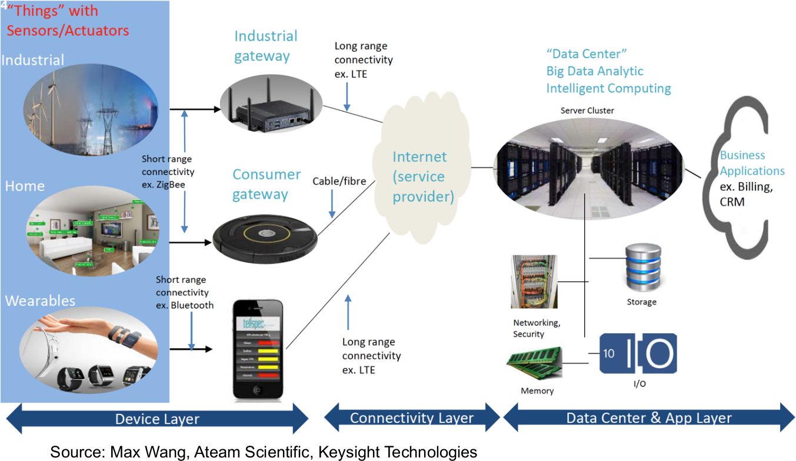
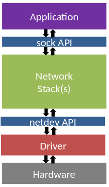
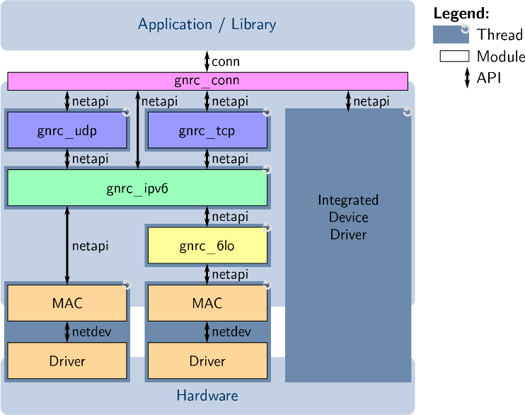
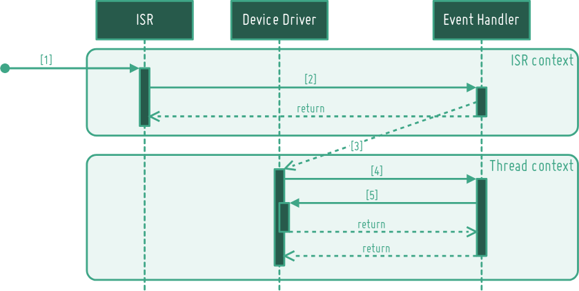
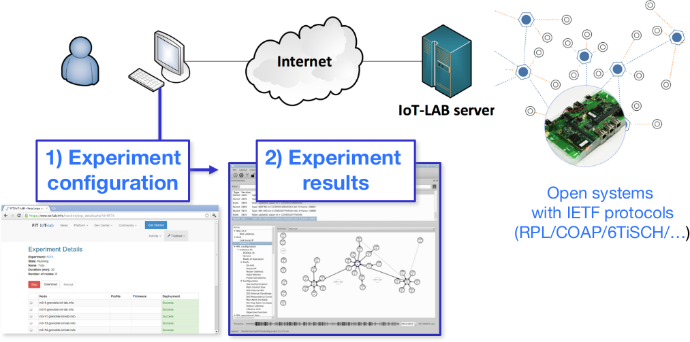

class: center, middle

# Networking in RIOT

---

## IoT in the digital world


.center[
    
]

.right[<span style="font-style: italic;font-size:12px">Source: https://www.keysight.com/upload/cmc_upload/All/Slide_IOT_Part_1.pdf</span>]

---

## Overview of networking technologies for IoT

.center[
    
]

---

## Mapping IoT technologies to OSI layers

.center[
    
    <br><br>
    &#x21d2; RIOT supports ZigBee (6LowPAN), Thread and soon BLE and WiFi
]

---

## Lots of IoT specifications exist

- **Physical layer**

  &#x21d2; PLC, BACnet, Z-WAze, BLE, IEEE 802.15.4, LoRa, SigFox, IEEE 802.11

- **Network layer** interop with IP networks

  &#x21d2; 6TiSCH, 6LowPAN, RPL, OLSRv2, AODVv2, LoRaWAN

- **Application layer** interop with the Web

  &#x21d2; CoAP, LwM2M, MQTT, CBOR, DTLS, OSCOAP

- **New paradigms**

  &#x21d2; Information centric network (ICN)

.right[
    
]

---

## Available stacks

- **LwIP**
  - full featured network stack
  - provided as a package in `pkg/lwip`

- **emb6**
  - port of Contiki stack without protothreads
  - provided as a package in `pkg/emb6`

- **OpenThread**
  - Opensource implementation of the Thread specifications
  - provided as a package in `pkg/openthread`

- **Controller Area Network** (CAN) stack
  - Native mode (SocketCAN) + driver for TJA1042

- **LoRaWAN**:
  - based Semtech Loramac-node reference implementation
  - provided as a package in `pkg/semtech-loramac`

---

## Networking architecture in RIOT

&#x21d2; designed to integrate any network stack into RIOT

<table>
<tr>
  <td>
    <ul>
      <li>Network are decoupled from the hardware via the <b>netdev</b> API<br><br></li>
      <li>Application are decoupled from network stack via the <b>sock</b> API<br><br></li>
      <li>Each device runs in its <b>own thread</b><br><br></li>
      <li>Radio drivers are implemented in `drivers`<br><br></li>
      <li>Network APIs are defined in `sys/include/net` and implemented in `sys/net`<br><br></li>
    </ul>
  </td>
  <td>
.center[
    
]
  </td>
</tr>
</table>

---

## The GNRC stack of RIOT

.center[
    
]

- Radio drivers are accessed through the **netdev** API

- All internal components use a single API: **netapi**

- The applications uses the **sock** API (previously called `conn`)

---

## Network device driver API

<br>

.center[
    
]

- Radio events trigger interrupts &#x21d2; ISR context

- RIOT makes a good use of thread to manage them nicely<br>
  &#x21d2; move fast from ISR context to netdev thread context

- More information here: <br>
http://doc.riot-os.org/group__drivers__netdev__api.html

---

class: middle, center

# Practice

---

## IPv6 networking: practice (1)

- **Objective:** IPv6 networking between 2 RIOT native instances

1. Configure a network bridge with 2 virtual interfaces (`tap`) with the
   following command (user password is user):

```sh
$ sudo ~/RIOT/dist/tools/tapsetup/tapsetup -c 2
$ ifconfig
```

2. Build the `gnrc_networking` example application for native:

```sh
$ make -C ~/RIOT/examples/gnrc_networking all
```

3. In separate terminals, start 2 native instances of RIOT on each `tap`
interface created (tap0 and tap1):

```sh
$ sudo PORT=tap0 make -C ~/RIOT/examples/gnrc_networking term
main(): This is RIOT! (Version: workshop-captronic)
RIOT network stack example application
All up, running the shell now
> help
```
---

## IPv6 networking: practice (2)

- Check the link local IPv6 address of each instance using `ifconfig`:

```sh
> ifconfig
Iface  6  HWaddr: 0a:46:47:86:27:e8 
          MTU:1500  HL:64  RTR  
          RTR_ADV  
          Source address length: 6
          Link type: wired
          inet6 addr: fe80::846:47ff:fe86:27e8  scope: local  THIS ONE!
          inet6 group: ff02::2
[...]
```

- Verify that you can ping them:

```sh
> ping6 fe80::846:47ff:fe86:27e8
12 bytes from fe80::846:47ff:fe86:27e8: id=83 seq=1 hop limit=64 time = 0.340 ms
```

---

## IPv6 networking: practice (2)

- On one of the RIOT native instance, start an UDP server on port 8888:

```sh
> udp server start 8888
Success: started UDP server on port 8888
```

- Send an UDP packet from the other instance:

```sh
> udp send fe80::846:47ff:fe86:27e8 8888 HelloWorld!
```

- Verify that you receive a packet dump on the udp server:

```sh
 PKTDUMP: data received:
~~ SNIP  0 - size:  11 byte, type: NETTYPE_UNDEF (0)
00000000  48  65  6C  6C  6F  57  6F  72  6C  64  21
~~ SNIP  1 - size:   8 byte, type: NETTYPE_UDP (3)
   src-port:  8888  dst-port:  8888
   length: 19  cksum: 0x9e9e
~~ SNIP  2 - size:  40 byte, type: NETTYPE_IPV6 (1)
traffic class: 0x00 (ECN: 0x0, DSCP: 0x00)
[...]
~~ SNIP  3 - size:  22 byte, type: NETTYPE_NETIF (-1)
[...]
~~ PKT    -  4 snips, total size:  81 byte
```

---

## IPv6 networking: practice (3)

Let's communicate between the host and the RIOT instance!

- From the Linux host, verify that ping works:

```sh
$ ping6 fe80::846:47ff:fe86:27e8%tapbr0
```

- From the Linux host, send an UDP messag:

```sh
$ echo -n "hello" >/dev/udp/fe80::846:47ff:fe86:27e8%tapbr0/8888
```

- Using netcat, connect to the UDP server and start sending messages:

```sh
$ nc -6uv fe80::846:47ff:fe86:27e8%tapbr0 8888
Connection to fe80::846:47ff:fe86:27e8%tapbr0 8888 port [udp/*] succeeded!
HelloWorld!
```

---

## Using CoAP: practice

- Build the `nanocoap_server` example application for native:

```sh
$ make -C ~/RIOT/examples/nanocoap_server all
```

- Start a native instance of RIOT:

```sh
$ sudo PORT=tap0 make -C ~/RIOT/examples/nanocoap_server term
main(): This is RIOT! (Version: workshop-captronic)
RIOT nanocoap example application
Waiting for address autoconfiguration...
Configured network interfaces:
Iface  5  HWaddr: 0a:46:47:86:27:e8 
          MTU:1500  HL:64  Source address length: 6
          Link type: wired
          inet6 addr: fe80::846:47ff:fe86:27e8  scope: local
```

- From the Linux host, query the CoAP server running on the native instance:

```sh
$ coap-client -m get coap://[fe80::846:47ff:fe86:27e8%tapbr0]/.well-known/core
v:1 t:CON c:GET i:b615 {} [ ]
</.well-known/core>,</riot/board>,</riot/value>
$ coap-client -m get coap://[fe80::846:47ff:fe86:27e8%tapbr0]/riot/board
v:1 t:CON c:GET i:c84c {} [ ]
native
```
---

## Testing IPv6 on hardware

We will use an experiment platform called IoT-LAB: https://www.iot-lab.info
<br><br>

.center[
    
]

.right[
    
]

---

## Using an Atmel SAMR21 XPlained Pro on IoT-LAB

See: https://www.iot-lab.info/tutorials/use-samr21-nodes/

---

## Public IPv6 networking

See: https://www.iot-lab.info/tutorials/riot-public-ipv66lowpan-network-with-m3-nodes/

Small change:

- Use samr21-xpro instead of iotlab-m3

- Skip border-router related steps

---

## CoAP

See: https://www.iot-lab.info/tutorials/coap-using-riot-with-m3-nodes/

Small change:

- Use samr21-xpro instead of iotlab-m3

- Skip border-router related steps
