class: center, middle

# LoRaWAN with RIOT

---

## IoT protocols

.center[
  iser  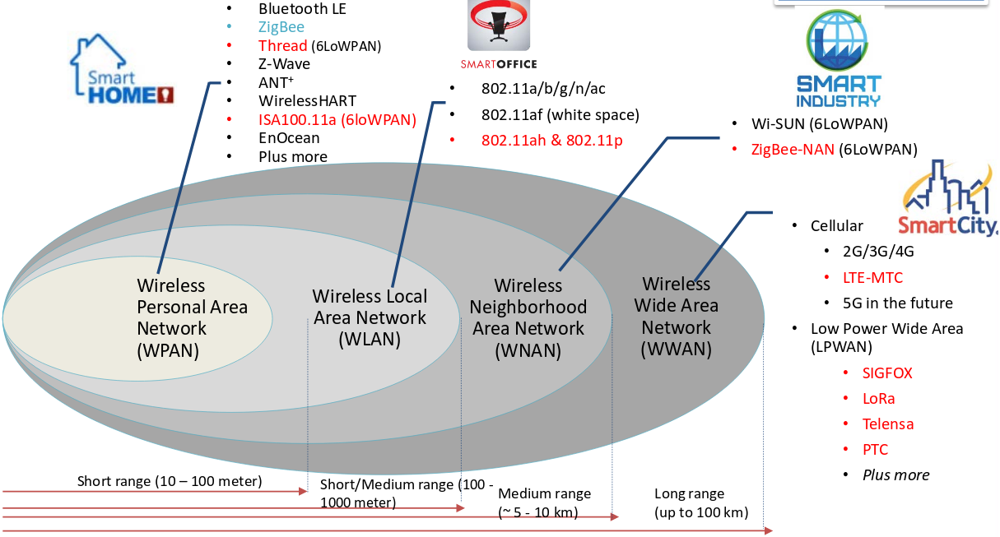
]

---

## Overview of LoRaWAN

<br/>

- Designed by Semtech and promoted by the LoRa Alliance

<br/>
.center[
    <a href=https://www.semtech.com/></a>
    <a href=http://www.lora-alliance.org/></a>
]

<br/>


- First release 1.0 of the LoRaWaN specification in 2015

- Latest release 1.1 in 2018

- Based on long range radio communication modulation, LoRa

- Star network topology &#x21d2; devices talks to the network via gateways

---

## A few words on LoRa

<table style="width:100%;margin-top:-40px">
<tr>
  <td><ul>
  <li>Long range radio technology<br/><br/></li>
  <li>Spread Spectrum modulation: <br/><br/>&#x21d2; "Chirp Spread Spectrum"<br/><br/></li>
  <li>Very robust to noise</li>
  </ul></td>
  <td>.center[
      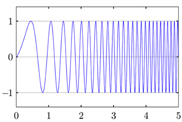<br/>
      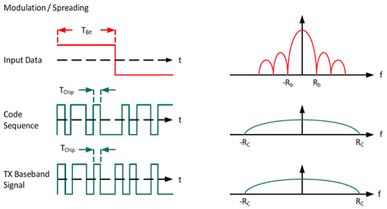
    ]
</tr>
<tr>
  <td><ul>
        <li>Raising the spreading factor:
        <br/><br/>
            <ul>
                <li>increases the range (until several kilometers)</li>
                <li>decreases the bandwidth</li>
                <li>increases the time on air</li>
            </ul>
        </li>
    </ul>
  </td>
  <td>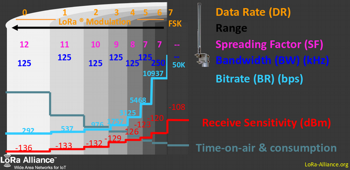</td>
</tr>
</table>

---

## The LoRaWAN protocol

.center[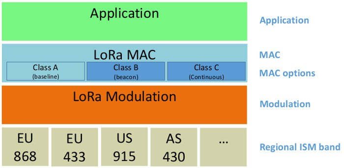<br/>]

<br/>

- Different frequency bands depending on the geographical regions


- Use LoRa modulation


- 3 device classes &#x21d2; A, B & C


- The application layer is directly on top of the MAC layer

---

## Access to the physical layer

.center[
    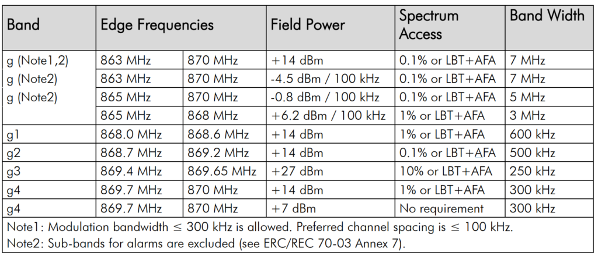
]

<br/>

- Public and free **ISM bands** used: EU868 (ETSI), US915, etc

- Bands are divided into **channels** of 3 different widths: 125kHz, 250kHz ou 500kHz

- Time constrained access to the physical layer &#x21d2; **Duty Cycle** (1% / channel)

- Example: at least 16 channels can be used in EU868 band


---

## Class A & C devices

<table style="width:100%">
<tr>
  <td><b>Class A device</b>
  <ul>
  <li>Can only receive after a send</li>
  <li>Smallest power consumption</li>
  <li>Can be used on battery</li>
  </ul>
  
  </td>
  <td>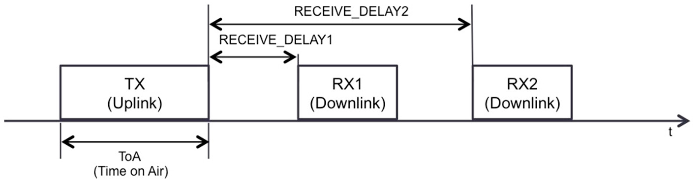<br/>
  .center[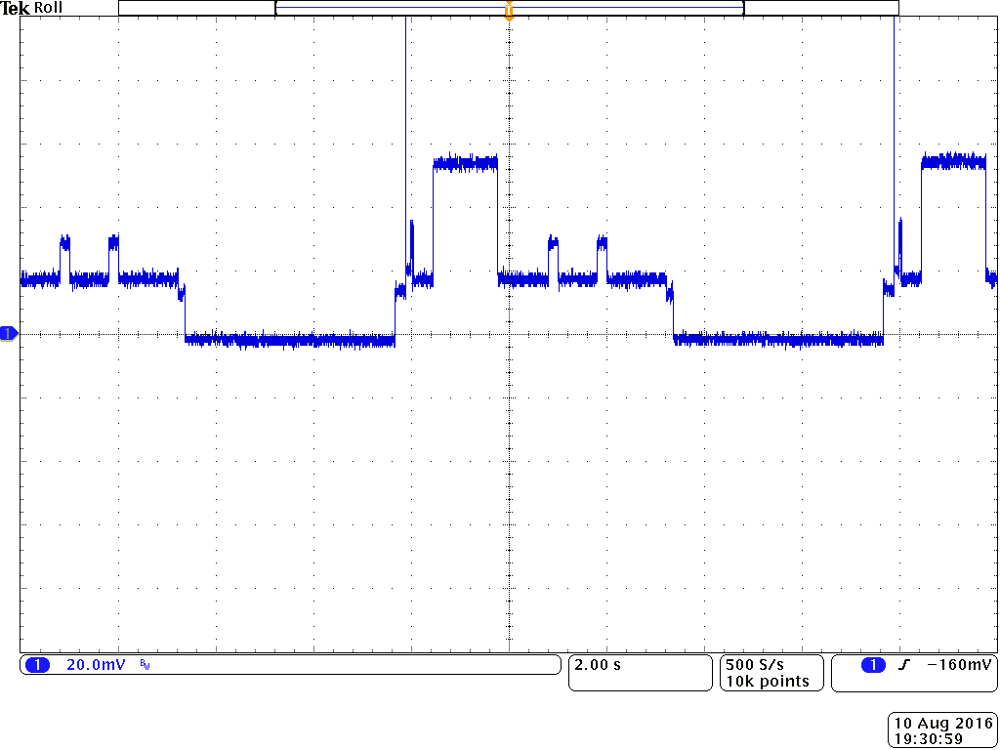<br/>
<span style="left-margin: 10px;font-style: italic;font-size:12px;text-align:right">Power consumption of a class A device</span>]</td>
</tr>
</table>

<table style="width:100%">
<tr>
  <td><b>Class C device</b>
  <ul>
  <li>Always listening: low latency</li>
  <li>More power consumption</li>
  <li>Cannot be used on battery</li>
  </ul>
  </td>
  <td>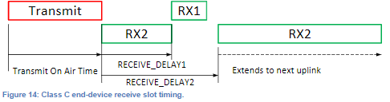<br/></td>
</tr>
<table>

---

## LoRaWAN network architecture

.center[
    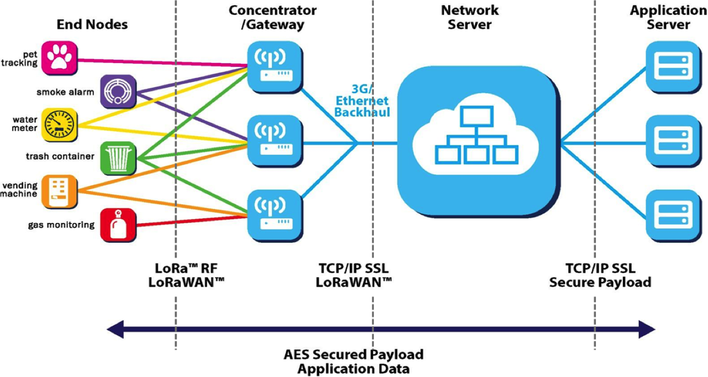<br/>
]

- **Devices and gateways** exchange messages using LoRa communications

- **Gateway** are connected to the network server via regular Internet protocols

- Users access their data via an application connected to the network server

- Security of the data is garantueed by **AES** encryption (symmetric keys)

---

## Structural overview of the network parts

.center[
    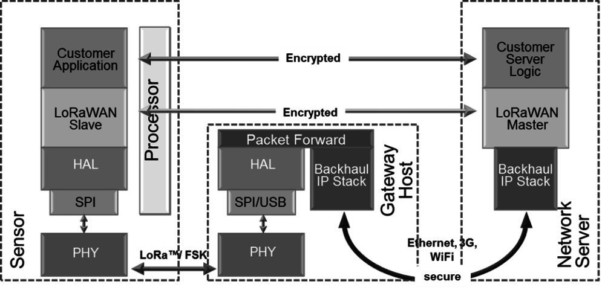<br/>
]

<table style="width:100%">
<tr>
  <td><b>Gateway manufacturers</b>
  <ul>
  <li>IMST Lite Gateway https://shop.imst.de</li>
  <li>Kerlink https://www.kerlink.fr/</li>
  <li>Multitech: https://www.multitech.com/</li>
  </ul>
  </td>
  <td><b>Network servers implementation</b>
  <ul>
  <li>https://www.loraserver.io/ (Opensource)</li>
  <li>https://www.resiot.io/en/<br><br><br></li>
  </ul>
  </td>
</tr>
<table>

---

## How to program the end-device

Existing open-source implementations:

- Arduino LMIC https://github.com/matthijskooijman/arduino-lmic
  &#x21d2; nearly unmaintained

- Arduino LoRa https://github.com/sandeepmistry/arduino-LoRa
  &#x21d2; active

- Loramac-node https://github.com/Lora-net/LoRaMac-node
  &#x21d2; reference implementation, used for certification from LoRa Alliance

<br>

End-device high-level support (generally based on Loramac-node):

- ARM mbedOS: https://www.mbed.com/en/platform/mbed-os/

- Mynewt: https://mynewt.apache.org/

- Micropython: https://pycom.io/

- RIOT: https://riot-os.org/

---

## Device communication on the network

.center[
    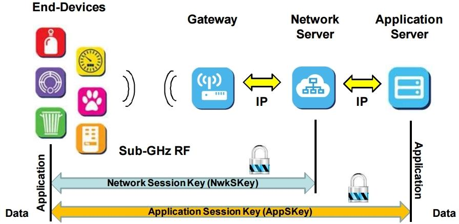<br/>
]

<br/>

- Every device is identified by a 4 bytes address

- "Network session key" &#x21d2; used to encrypt the network related data (MAC)

- "Application session key" &#x21d2; used to encrypt the application related data

---

## Activation procedures

.center[To exchange data, all devices must be activated by the network]

&#x21d2; 2 type of activation procedures:

- Over-The-Air Activation(OTAA)

- Activation By Personnalization (ABP)

.center[
    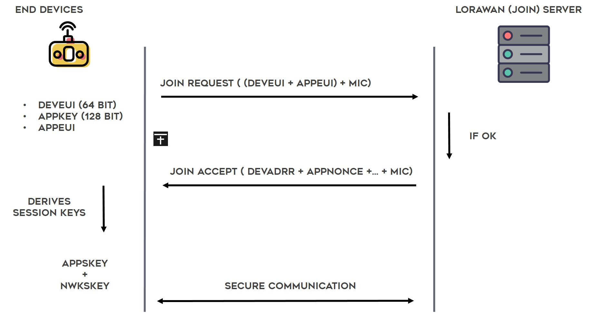<br/>
]

---

## Activation procedures


- in **OTAA**:
  - Requires Device EUI, Application EUI and Application Key information

  - The device initiates a handshake with the server to get its address and a "nonce" &#x21d2; the device address changes after each activation

  - The 2 session keys are derived from the application key and the nonce

- in **ABP**

  - Requires Application session key, Network session key and device address

  - No handshake required

---

## Network operators

Lots of public network operators:

- Actility https://www.actility.com/

- Loriot https://www.loriot.io/

- Objenious (Bouygues Telecom) http://objenious.com/

- Orbiwise  https://www.orbiwise.com/

- TheThingsNetwork https://www.thethingsnetwork.org/

.center[
    <br/>
]

---

## TheThingsNetwork (TTN)

- The network deployment is **community based**

- Software stack is open-source

.center[
    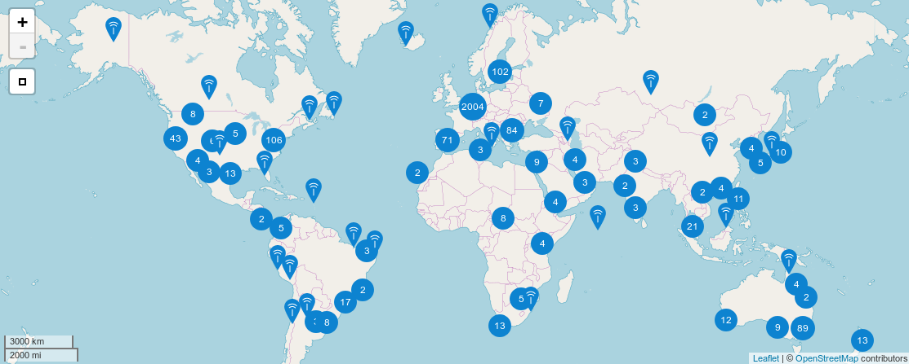<br/>
]

- Unlimited access to the backend

  - no device limit

  - no message limit (with respect to the duty-cycle)

  - friendly API (MQTT)

---

## First steps with TTN: practice

1. Create an account<br>
  https://account.thethingsnetwork.org/register

  Manage your gateways and application from your web console: https://console.thethingsnetwork.org/

2. Managing your gateways (optional)<br>
  https://www.thethingsnetwork.org/docs/gateways/registration.html

3. Register your device in the `captronic-workshop` application<br>
  https://console.thethingsnetwork.org/applications/captronic-workshop

---

## Test TTN with RIOT: practice (1)

- Loramac port documentation <br>
http://doc.riot-os.org/group__pkg__semtech-loramac.html

- Build and run the test/demo application provided by RIOT (in `~/RIOT`)

```sh
make -C tests/pkg_semtech-loramac flash term
```

- Configure the device using the shell of RIOT

```sh
> loramac set deveui 0000000000000000
> loramac set appeui 0000000000000000
> loramac set appkey 00000000000000000000000000000000
```

- Join the network using OTAA activation procedure

```sh
> loramac join otaa
Join procedure succeeded!
```

- Send (and eventually receive) messages to the network

```sh
> loramac tx HelloWorld!
Tx done
```

---

## Test TTN with RIOT: practice (2)

- **Exercise:** `~/riot-course-exercises/riot-lorawan/simple`

- **Objective:**

  - Follow the Semtech Loramac package online documentation (in `RIOT
    Documentation.desktop link`) and write an application that sends "This is
    RIOT!" every 20 seconds

  - Configure the application for OTAA activation (use your Device EUI,
    application EUI and application key)

---

## Test TTN with RIOT: practice (3)

- **Exercise:** `~/riot-course-exercises/riot-lorawan/thread`

- **Objective:** Adapt your previous application as follows:

  1. Join the network from the main application

  2. Start a sender thread that sends messages every 20s

---

## The TTN MQTT API

- MQTT protocol uses a publish/subscribe approach
.center[
    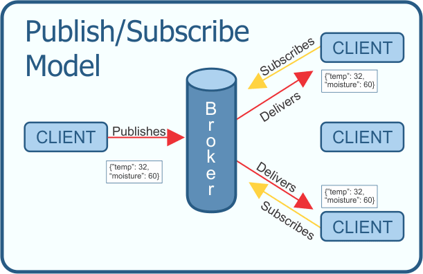<br/>
]

- TTN MQTT API documentation<br>
https://www.thethingsnetwork.org/docs/applications/mqtt/

- Reference implementation provided by the Eclipse Mosquitto project<br>
https://mosquitto.org/

- Eclipse also provides a python library: _paho_<br>
https://www.eclipse.org/paho/

---

## Using the MQTT API

.center[
    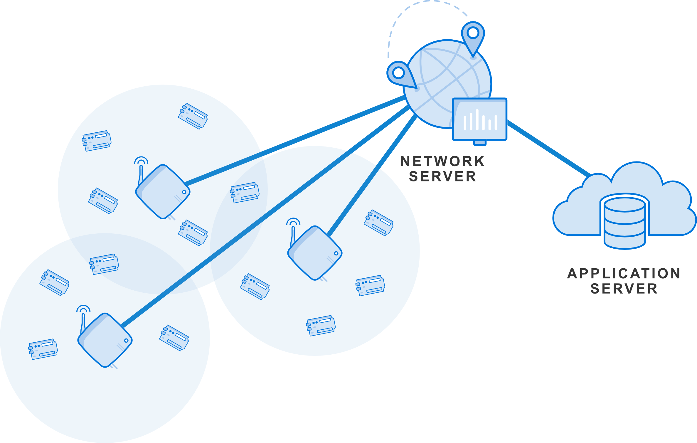<br/>
]

- Listening to upling messages (device to network):

```sh
$ mosquitto_sub -h eu.thethings.network -p 1883 -u <username> -P <password>
-t '+/devices/+/up'
```

- Sending a downling message (network to device):

```sh
$ mosquitto_pub -h eu.thethings.network -p 1883 -u <username> -P <password>
-t '<application id>/devices/<device id>/down'
-m '{"port":2, "payload_raw":"dGVzdA=="}'
```

---

## TTN with RIOT: practice (1)

- **Exercise:** `~/riot-course-exercises/riot-lorawan/downlink`

- **Objective:**

  - Use the `mosquitto_sub` command to receive the messages sent by the device

  - Modify the `downlink` application to make LED1 blink when a message is
    received

  - Use `mosquitto_pub` to send downlink messages to the device and verify
    that the firmware behaves as expected

_TIP_: base64 payload can be decoded with the command
```sh
$ base64 -d <<< dGVzdA==
```

---

## TTN with RIOT: practice (2)

- **Exercise:** `~/riot-course-exercises/riot-lorawan/sensor`

- **Objective:**

  - Modify the application in `~/riot-course-exercises/riot-lorawan/thread` to
    make it read and send every 20s the HTS221 sensor values. The format of the
    message will be `T: XX.X°C, H: XX.X%`

_TIP_: Reuse parts of the code from `~/riot-basics/drivers` application

---

## Integration with external services

- Use of TTN http and/or MQTT API to retrieve the IoT data

- Super simple to integrate

- Available services:

  - Customizable dashboards with Cayenne<br>
    https://mydevices.com/

  - Location service with Collos<br>
    http://preview.collos.org/

  - Gather and analyze workspace use and sensors with OpenSensors<br>
    https://opensensors.com/

  - Just store your IoT data with TheThingsIndustries<br>
    https://www.thethingsindustries.com/

---

## An example: Cayenne

https://mydevices.com/cayenne/docs/lora/#lora-the-things-network

- Create only dashboards in a few clicks from your LoRaWAN data

- Access your sensor data from anywhere

- Payload format requirement: Low Power Payload (LPP)

  - Library available for python/micropython:<br>
  https://github.com/jojo-/py-cayenne-lpp

  - Library available for Arduino (C++):<br>
  https://github.com/sabas1080/CayenneLPP

  - Generic library in C<br>
  https://github.com/aabadie/cayenne-lpp

---

## Integration with Cayenne: pratice

- **Exercise:** `~/riot-course-exercises/riot-lorawan/lpp`

- **Objective:**

  - Modify the application in `~/riot-course-exercises/riot-lorawan/sensor` to
    make it compatible with the Cayenne LPP format: use the `cayenne-lpp`
    package.

_TIP_: see `~/RIOT/tests/pkg_cayenne-lpp` sample application

---

## Final application: adding low power

- **Exercise:** `~/riot-course-exercises/riot-lorawan/pm`

- **Objective:**

  - Start from application `~/riot-course-exercises/riot-lorawan/sensor`

  - Modify the sender thread so that it triggers a send only after a message is
    received

  - After a LoRaWAN send, configure an RTC alarm 20s later

  - In the RTC alarm callback, send a message to the sender thread

  - Test the application

  - Include `pm_layered.h` and use `pm_set(1)` to put the CPU in STOP mode
    after the RTC alarm is set
    (check the differences with pm_set(0))

---

class: center, middle

# The End
