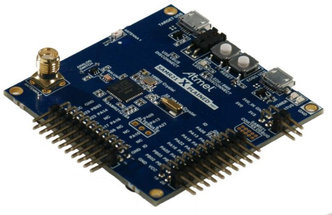
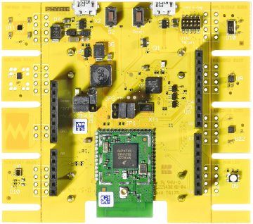

# Task 1: Starting the RIOT

## Task 1.1: Run your first application as Linux process

1.  Compile and run on `native` platform:
    ```sh
    make all term
    ```

2.  Run `help` to see a list of all available commands
    ```
    > help
    help
    Command              Description
    ---------------------------------------
    reboot               Reboot the node
    version              Prints current RIOT_VERSION
    pm                   interact with layered PM subsystem
    ps                   Prints information about running threads.
    ```

3.  Look at the output of `ps`
    ```
    > ps
    ps
            pid | name                 | state    Q | pri | stack  ( used) ( free) | base addr  | current
              - | isr_stack            | -        - |   - |   8192 (   -1) ( 8193) | 0x565b8380 | 0x565b8380
              1 | idle                 | pending  Q |  15 |   8192 (  436) ( 7756) | 0x565b60a0 | 0x565b7f00
              2 | main                 | running  Q |   7 |  12288 ( 3196) ( 9092) | 0x565b30a0 | 0x565b5f00
                | SUM                  |            |     |  28672 ( 3632) (25040)
    ```

4.  Add a print statement to the `main()` function to output the name of the board.
    ```
    printf("This application runs on %s\n", RIOT_BOARD);
    ```

    Recompile and run again:
    ```sh
    make all term
    ```

## Task 1.2: Run your first application on real hardware
1.  Get to know your hardware

    *Atmel SAM R21 Xplained Pro*

    

    MCU                    | ATSAMR21G18A
    -----------------------|------------------------------------
    Family                 | ARM Cortex-M0+
    Vendor                 | Atmel
    RAM/ROM                | 32Kb / 256Kb
    Frequency              | up to 48MHz
    Timers                 | 6 (1x 16-bit, 2x 24-bit, 3x 32-bit)
    ADCs                   | 1x 12-bit (8 channels)
    UARTs / SPIs / I2Cs    | max 5 (shared)
    Vcc                    | 1.8V - 3.6V
    Radio                  | IEEE802.15.4 @ 2,4GHz
    Sensors                | none

    *Phytec phyNODE KW22*

    

    MCU                    | MKW22D512
    -----------------------|------------------------------------
    Family                 | ARM Cortex-M4
    Vendor                 | Kinetis
    RAM/ROM                | 65Kb / 512Kb
    Frequency              | up to 50MHz
    Timers                 | up to 12 (16-bit, 24-bit, 32-bit)
    ADCs                   | 1x 16-bit (8 channels)
    UARTs / SPIs / I2Cs    | 3 / 1 / 2
    Vcc                    | 1.8V - 3.6V
    Radio                  | IEEE802.15.4 @ 2,4GHZ
    Sensors                | diverse

2.  To compile an application for a specific board, we can make use of the `BOARD` environment
    variable.

    In case you are running on an Atmel board, type:
    ```sh
    BOARD=samr21-xpro make all flash term
    ```

    For the (yellow) phyNODE use;
    ```sh
    BOARD=pba-d-01-kw2x make all flash term
    ```

    This command will compile the application, burn the image onto the board and open a
    connection to the RIOT shell.

3.  Verify the output of `RIOT_BOARD` matches your hardware.

[next task](../task-02)
