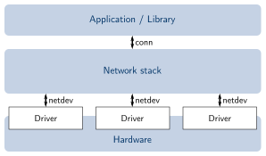

[previous task](../task-04)

# Task 5: Using network devices

## RIOT's Networking architecture
Network devices are accessed through [`netdev`](https://doc.riot-os.org/group__drivers__netdev__api.html) driver API



It has capabilities for receiving and sending data and for getting and setting
options or states.

Note inclusion of `netdev` modules in the [Makefile](Makefile)

```Makefile
USEMODULE += gnrc_netdev_default
USEMODULE += auto_init_gnrc_netif
```

## Virtual network interface on `native`
* Use `tapsetup` script in RIOT repository:

```sh
./../RIOT/dist/tools/tapsetup/tapsetup -c 2
```

* Creates
    - Two TAP interfaces `tap0` and `tap1` and
    - A bridge between them (`tapbr0` on Linux, `bridge0` on OSX)
* Check with `ifconfig` or `ip link`!

## Task 5.1 -- Your first networking application
* Run the application on `native`: `make all term PORT=tap0`
* Type `help`
* Run a second instance with `make all term PORT=tap1`
* Type `ifconfig` on both to get hardware address and interface number
* Use `txtsnd` command to exchange messages between the two instances

## Task 5.2 -- Use your application on real hardware
* Compile, flash, and run on the board `BOARD=samr21-xpro make all flash term`
* Type `ifconfig` to get your hardware addresses
* Use `txtsnd` to send one of your neighbors a friendly message

[Read the Doc](https://doc.riot-os.org/group__drivers__netdev__api.html)

[next task](../task-06)
